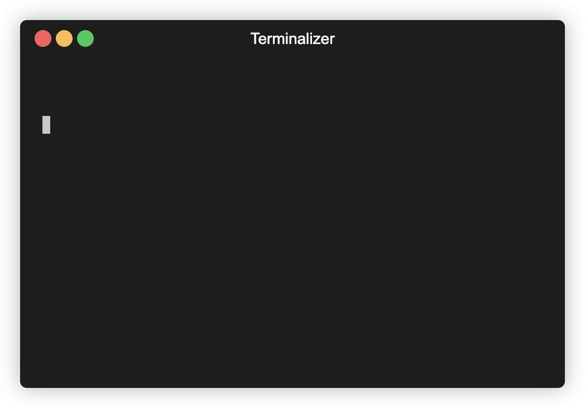

# Perfect CLI

Perfect CLI is a npm library for creating creating a CLI with the perfect
interaction model:

- By default, never error for an argument error
  - Go into interactive mode if there are any argument errors
- If `-y` is passed, run in non-interactive mode
- If `-i` is passed, run in interactive mode
- All commands and parameters can be configured and explored interactively
- By default, running the command without args is always interactive



## Usage

> Perfect CLI uses the same interface as [commander](https://www.npmjs.com/package/commander)

```ts
import { perfectCli } from "perfect-cli"
import { program } from "commander"

program.name("my-cli")

const packagesCmd = program
  .command("packages")
  .description("Functions for packages")

packagesCmd
  .command("list")
  .description("List all packages")
  .action(() => {})

packagesCmd
  .command("create")
  .requiredOption("-n, --name <name>")
  .option("-d, --description <description>")
  .action(() => {})

packagesCmd
  .command("get")
  .option("-n, --name <name>", "Package name")
  .option("-i, --id <id>", "Package Id")
  .option("--sha <sha>", "Package Commit SHA")
  .description("Get a single package")
  .action((args) => {
    console.log("packages get invoked!", args)
  })

const usersCmd = program.command("users").description("Functions for users")

usersCmd
  .command("list")
  .description("List all users")
  .action(() => {})

perfectCli(program, process.argv)
```

### Custom Prompts for Options

You can create custom prompts for options, for example if you wanted to make
a special autocomplete for an `--id` parameter by pinging a server for all
the possible resources that can be selected. To do this, provide the
`customParamHandler` to `perfectCli`, as shown below:

```ts
perfectCli(program, process.argv, {
  async customParamHandler({ commandPath, optionName }, { prompts }) {
    if (commandPath[0] === "packages" && optionName === "id") {
      return (
        await prompts({
          type: "select",
          name: "id",
          choices: [
            {
              title: "Package 1",
              value: "1",
            },
            {
              title: "Package 2",
              value: "2",
            },
          ],
          message: "Select the package ID",
        })
      ).id
    }
  },
})
```
